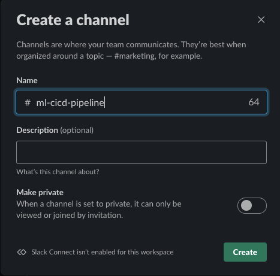
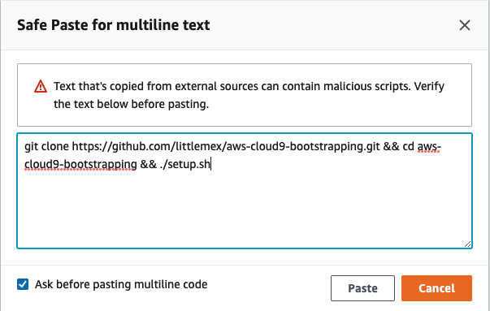
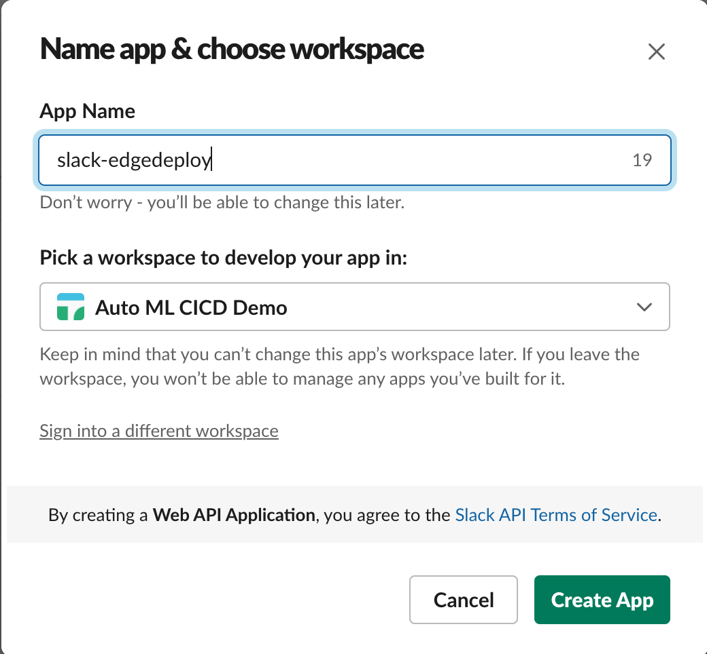

# 機械学習モデル CI/CD デモセット
## このデモセットについて
このデモセットは、機械学習モデルの開発、デプロイを効率的に行うための CI/CD パイプラインを AWS で構築するサンプルとなっています。


機械学習 CI/CD の挙動については、デモとして動画にまとまっており、動画を解説するための参考資料もあります。ご自身でデモ環境を構築する場合は、ZIP ファイルをと本 README を参考にしてください。

- [機械学習 CI/CD パイプラインデモ動画](https://amazon.awsapps.com/workdocs/index.html#/folder/652a9860849fd045714f702590b673db21f15f01625e212573d1ece91424346d)
- [機械学習 CI/CD パイプラインデモ動画 解説スクリプト](https://quip-amazon.com/sU3pAGLbZ0de/20220527-CICD-)
- [機械学習 CI/CD パイプラインサンプルコード Zip ファイル](https://collaborate-corp.amazon.com/nuxeo/ui/#!/browse/default-domain/workspaces/New%20Managed%20Content%20Workspace.1506032745336/ML%20CI-CD%20Edge%20Deploy%20Pipeline%20%E3%82%B5%E3%83%B3%E3%83%97%E3%83%AB%E3%82%B3%E3%83%BC%E3%83%89)
- [機械学習 CI/CD パイプライン解説資料](https://collaborate-corp.amazon.com/nuxeo/ui/#!/browse/default-domain/workspaces/New%20Managed%20Content%20Workspace.1506032745336/%20ML%20CI-CD%20Edge%20Deploy%20Pipeline%20%E8%A7%A3%E8%AA%ACPPT)

デモセットの構築は、下記の手順で行います。
1. 学習パイプラインで使う GitHub リポジトリの準備
2. パイプライン進捗通知のための Slack の準備
3. デモセットデプロイ用環境 兼 機械学習エッジ推論環境を AWS Cloud9 に準備
4. AWS CDK を使った ML CI/CD パイプラインのデプロイ


## 1. 学習パイプラインで使う GitHub リポジトリの準備
### 1.1 Github アカウントの作成
まず、[アカウントの作成方法](https://docs.github.com/ja/get-started/onboarding/getting-started-with-your-github-account)を参考に GitHub のアカウントを作成下さい。

GitHub アカウント作成が完了したら、`aws-ml-cicd-edge-deploy` と `aws-ml-cicd-training-script` の２つのリポジトリを作成します。

`aws-ml-cicd-edge-deploy` リポジトリには zip ファイルの中身をアップロードします。 `cdk_ml_cicd_pipeline/setup.sh` にある `PREFIX` をお好きなプレフィックスを指定して上書きします。変更を、 `main` ブランチへ `push` し更新して下さい。

続いて、`aws-ml-cicd-training-script` リポジトリには。`aws-ml-cicd-edge-deploy` リポジトリの `training_scripts_repository` ディレクトリの中身をコピーして main ブランチに push します。また作成したアカウント及び `aws-ml-cicd-training-script` リポジトリと、後に作成する ML CI/CD パイプラインを接続するために AWS CodePipeline  とのコネクションを作成作成します。ユーザーガイドの [GitHub の接続](https://docs.aws.amazon.com/ja_jp/codepipeline/latest/userguide/connections-github.html) を参考位に接続をし、Connection ARN をメモして下さい。

## 2. パイプライン進捗通知のための Slack の準備
### 2.1 Slack アカウントの作成
この ML CI/CD パイプラインでは、パイプラインで学習された ML モデルのデプロイ可否判断をユーザーに促すために、Slack への通知を行います。活用できる Slack のアカウントやワークスペースを下記を参考にご準備下さい。

* [Slack のはじめ方 - 新規 Slack ユーザー編](https://slack.com/intl/ja-jp/help/articles/218080037-Slack-%E3%81%AE%E3%81%AF%E3%81%98%E3%82%81%E6%96%B9---%E6%96%B0%E8%A6%8F-Slack-%E3%83%A6%E3%83%BC%E3%82%B6%E3%83%BC%E7%B7%A8)
* [Slack のはじめ方 — ワークスペース作成者編](https://slack.com/intl/ja-jp/help/articles/217626298-Slack-%E3%81%AE%E3%81%AF%E3%81%98%E3%82%81%E6%96%B9-%E2%80%94-%E3%83%AF%E3%83%BC%E3%82%AF%E3%82%B9%E3%83%9A%E3%83%BC%E3%82%B9%E4%BD%9C%E6%88%90%E8%80%85%E7%B7%A8)

### 2.2 ワークスペースの作成
準備した Slack のワークスペースで、ml-cicd-pipeline という新規のチャンネルを作成します。



Slack アプリの作成 create new app ボタンから、アプリ名を ML-CICD-pipeline として作成します。


アプリのページへ移動した後に、Slack での [Incoming Webhook の利用](https://slack.com/intl/ja-jp/help/articles/115005265063-Slack-%E3%81%A7%E3%81%AE-Incoming-Webhook-%E3%81%AE%E5%88%A9%E7%94%A8) を参考に、Add New webhook to Workspace から Webhook URL を取得します。


ここで作成した Webhook URL は後ほど使うのでメモしておきます。

## 3. デモセットデプロイ用環境 兼 機械学習エッジ推論環境を AWS Cloud9 に準備

機械学習 CI/CD パイプラインをデプロイするための環境として AWS Cloud9 を活用します。この AWS Cloud9 環境は、以下のコマンドを使用して準備することができます。必要なツールのインストールがされている [CloudShell](https://console.aws.amazon.com/cloudshell)から作成することがをおすすめします。それ以外の場合は、[AWS CLI](https://docs.aws.amazon.com/cli/latest/userguide/install-cliv2.html) をローカルマシンにインストールする必要があります。その場合には実行デフォルトのプロファイルに AWS アカウントへの管理者アクセス権があることを確認します。

AWS Management ConsoleのServicesメニューで、[CloudShell](https://console.aws.amazon.com/cloudshell/home)に移動します。その後、以下のコマンドをターミナルにコピー＆ペーストします。 コマンド中の「アカウント名」はお使いの GitHub アカウント名へ変更下さい。

`git clone https://github.com/tkazusa/auto-ml-cicd-edge-deploy-2.git && cd cloud9_bootstrapping && ./setup.sh`

CloudShell の Safe Paste が表示されたら `Paste` を選択して続行します。



上記コマンド実行後、しばらくするとターミナルに "Cloud9 Instance is Ready!!!" というメッセージが出力されます。これは、Cloud9環境の作成が成功したことを示しています。

続いて、こちらを[参考](https://catalog.us-east-1.prod.workshops.aws/workshops/31676d37-bbe9-4992-9cd1-ceae13c5116c/ja-JP/installation/not-using-ee/deploy-app)に Cloud9  IAM 権限の設定、既存の一時的な認証情報の削除、を行って、ML CI/CD パイプラインのデプロイを行う準備をします。 `cdk bootstrap` まで実行して下さい。

## 4.  AWS CDK を使った ML CI/CD パイプラインのデプロイ
### 4.1  ML CI/CD スタックのデプロイのための設定を行う

AWS CDK で定義されている ML CI/CD パイプラインのスタックをデプロイします。上記で準備した Cloud9 のターミナル上、下記を実行します。

```
$ cd ~/environment
$ git clone https://github.com/<アカウント名>/auto-ml-cicd-edge-deploy.git
```

デプロイのための設定が記載されている `aws-ml-cicd-edge-deploy/cdk_ml_cicd_pipeline/cdk.json`  に手順 1.1 で作成した  GitHub のアカウント名、オーナー、ブランチ情報をそれぞれ `repo`, `owner`, `branch` に設定します。また、メモしておいた、GitHub 接続の Arn 情報をの `train.connection` に設定します。VPCのCIDRが他の環境と重複がないように設定します。同一アカウントでスタックを複数デプロイする場合、重複が内容注意して下さい。

```JSON
    "train": {
      "connection": "arn:aws:codestar-connections:us-east-1:xxxxxxxxxxxx:connection/xxxxxxx",
      "repo": "aws-ml-cicd-training-script",
      "owner": "xxxx",
      "branch": "main",
      "vpc":{
        "cidr": "10.0.0.0/16"
      }
    }
```

手順 2.2 で作成した Slack の Webhook URL を、`rain.slack_hook_url` に設定します。

```
   "train": {
      ...
      "slack_hook_url": "https://hooks.slack.com/services/xxxxxxx/xxxxxxxx/xxxxxxxxxxxxxxx
    }
```

### 4.2  AWS CDK を用いてスタックをデプロイ

cdk.json の変更後、下記コマンドを実行し、AWS CDK で定義されたスタックをデプロイします。

`cd aws-ml-cicd-edge-deploy/cdk_ml_cicd_pipeline && ./setup.sh`

AWS コンソール CloudFormation から作成したスタックを確認します。

### 4.3 学習に使うデータセットの準備

[PennFudanPed](https://www.cis.upenn.edu/~jshi/ped_html/PennFudanPed.zip) データセットをローカルにダウンロードして展開します。 CloudFormation コンソールからデプロイしたスタックの出力タブで確認できる `trains3Bucket` にデータをアップロードします。

### 4.4 機械学習モデルの学習のための設定

学習用リポジトリである `training_scripts_repository` にある `flow.yaml` に設定を記載します。

* config.sfn-role-arn に CloudFormation の出力タブに表示されている trainStepFunctionsWorkflowExecutionRole の Role ARN を記載する
* config.sagemaker-role-arn に CloudFormation の出力タブに表示されている trainAmazonSageMakerExecutionRole の Role ARN を記載する
* config.secretsmanager-arn に CloudFormation の出力タブに表示されている trainSecretsManagerArn の ARN を記載する
* experiments.mlflow-server-uri
* preprocess.input-data-path に上記1で画像をアップロードしたフォルダの S3 パスを記載する
* preprocess.output-data-path にデータ前処理後のデータを保存する S3 パスを記載する
* train.output-path に学習ジョブの出力データを保存する S3 パスを記載する
* evaluate.data-path にモデルの評価に使用するデータが保存されている S3 パスを記載する
* evaluate.result-path にモデル評価結果を保存する S3 パスを記載する

## 5 エッジへの機械学習モデルのデプロイ
### 5.1 Greengrassの関連する設定

コンポーネントのデプロイを行う場合は、事前にデプロイ先のGreengrassを用意しておく必要があります。
また、Greengrassにコンポーネントをデプロイする場合には、TESで利用されるRole似権限が付与されている必要があります。
ここでは、CDKで環境をセットアップした後に、コンポーネントのデプロイをする前に必要な手順を紹介します。

### 5.2 CDKで環境を作成した後に必要な作業

GreengrassのコンポーネントのもとになるスクリプトなどをCodeCommitやECRにアップロードしてください。具体的な手順は、[auto-ml-cicd-edge-deploy/edge_deploy/README.md](auto-ml-cicd-edge-deploy/edge_deploy/README.md) を参照してください

### 5.3 Token Exchange Service用のRoleを作成

Greengrassが利用するTESのRoleとRole Aliasを作成します。

```
cd aws-ml-cicd-edge-deploy/edge_deploy/setup_tes_role.py
python setup_tes_role.py --device_name デバイス名 --region 利用リージョン
```

実行すると、Greengrassのインストールで実行するコマンドが表示されますので、メモしておきます。

### 5.4 Greengrassを動かす環境の設定

この例ではCloud9(Ubuntu Server 18.04 LTS)を利用しますが、Raspberry PiなどGreengrassが動作するデバイスを用意していただいても構いません。その場合は、「Dockerの実行環境を用意」の手順に進んでください。

- AWSのマネージメントコンソールよりCloud9のenvironmentを作成します。
  - CDKをデプロイしたのと同じリージョンを利用してください
  - [Getting started: basic tutorials for AWS Cloud9](https://docs.aws.amazon.com/cloud9/latest/user-guide/tutorials-basic.html)

### 5.5  Dockerの実行環境を用意

デバイス上でデモ用のコンポーネントを実行する場合、Dockerの実行環境がセットアップされている必要があります。詳しいセットアップ方法は以下のページを参考に進めてください。
(Cloud9を環境として利用する場合は、この手順は不要です)

https://docs.aws.amazon.com/greengrass/v2/developerguide/run-docker-container.html


### 5.6 Greengrassのインストール

この作業は、Greengrassをインストールするデバイス上(Cloud9または、ご自身で用意したデバイス)で実行します。

####  環境変数の設定

Greengrassのセットアップに必要なため、ここでクレデンシャルを環境変数に設定します。リージョンは咲くほど作成したRoleと同じリージョンを指定します。
(セットアップ後はこのクレデンシャル情報は不要となります)

```
export AWS_DEFAULT_REGION=ap-northeast-1
export AWS_ACCESS_KEY_ID=
export AWS_SECRET_ACCESS_KEY=
```

#### Javaのインストール

V2からはJava 8以上が必要です。インストールされていない場合は、インストールしてください。

```
java --version
```

インストール

```
sudo apt install openjdk-11-jdk
```

#### Greengrassセットアップの実行

Greengrassソフトウエアのダウンロード

```
curl -s https://d2s8p88vqu9w66.cloudfront.net/releases/greengrass-nucleus-latest.zip > greengrass-nucleus-latest.zip

unzip greengrass-nucleus-latest.zip -d GreengrassCore && rm greengrass-nucleus-latest.zip
```

`Token Exchange Service用のRoleを作成` で表示された以下のようなコマンドを実行します。

```
sudo -E java -Droot="/greengrass/v2" -Dlog.store=FILE \
  -jar ./GreengrassCore/lib/Greengrass.jar \
  --aws-region AWS_DEFAULT_REGION \
  --thing-name GG_THING_NAME \
  --thing-group-name GG_THING_GROUP_NAME \
  --tes-role-name GG_TES_ROLE_NAME \
  --tes-role-alias-name TES_ROLE_ALIAS_NAME \
  --component-default-user ggc_user:ggc_group \
  --provision true \
  --setup-system-service true
```

#### インストール後の動作確認

Greengrassをセットアップする際に `--setup-system-service true` を指定すると、サービスとして登録され、自動で起動します。
 
ステータスの確認

```
sudo systemctl status greengrass.service
```
以下のように正常に起動したログが出ていれば成功です。

```
● greengrass.service - Greengrass Core
   Loaded: loaded (/etc/systemd/system/greengrass.service; enabled; vendor preset: disabled)
   Active: active (running) since Sun 2021-12-26 06:32:14 UTC; 37s ago
 Main PID: 19801 (sh)
    Tasks: 41
   Memory: 91.0M
   CGroup: /system.slice/greengrass.service
           ├─19801 /bin/sh /greengrass/v2/alts/current/distro/bin/loader
           └─19835 java -Dlog.store=FILE -Dlog.store=FILE -Droot=/greengrass/v2 -jar /greengrass/v2/alts/current/distro/lib/Greengrass.jar --setup-system-service...

Dec 26 06:32:14 ip-172-31-48-156.ec2.internal systemd[1]: Started Greengrass Core.
Dec 26 06:32:14 ip-172-31-48-156.ec2.internal sh[19801]: Greengrass root: /greengrass/v2
Dec 26 06:32:14 ip-172-31-48-156.ec2.internal sh[19801]: JVM options: -Dlog.store=FILE -Droot=/greengrass/v2
Dec 26 06:32:14 ip-172-31-48-156.ec2.internal sh[19801]: Nucleus options: --setup-system-service false
Dec 26 06:32:19 ip-172-31-48-156.ec2.internal sh[19801]: Launching Nucleus...
Dec 26 06:32:21 ip-172-31-48-156.ec2.internal sh[19801]: Launched Nucleus successfully.
```

Greengrassのサービスを停止する場合

```
sudo systemctl stop greengrass.service
```
 
Greengrassのサービスを開始する場合

```
sudo systemctl start greengrass.service
```
 
ログの確認
 
Greengrassのログは、デフォルトだと `/greengrass/v2` に出力されます。

```
sudo tail -F /greengrass/v2/logs/greengrass.log
```

### 5.8 推論用スクリプトの準備
#### recipe.yamlのソースコードを編集
recipe.yaml のLifecycle:、Artifacts:のdockerのリポジトリ名の `account-id`を `ご自身のアカウントID` に置き換えます。

```
---
RecipeFormatVersion: '2020-01-25'
ComponentName: com.example.ggmlcomponent
ComponentVersion: '__VERSION__'
ComponentPublisher: Amazon
ComponentDependencies:
  aws.greengrass.DockerApplicationManager:
    VersionRequirement: ~2.0.0
  aws.greengrass.TokenExchangeService:
    VersionRequirement: ~2.0.0
ComponentConfiguration:
  DefaultConfiguration:
    accessControl:
      aws.greengrass.ipc.mqttproxy:
        'com.example.ggmlcomponent:dockerimage:1':
          operations:
            - 'aws.greengrass#PublishToIoTCore'
          resources:
            - 'mlops/inference/result'
Manifests:
  - Platform:
      os: all
    Lifecycle:
      Run: "docker run account-id.dkr.ecr.region.amazonaws.com/base.com.example.ggmlcomponent:latest"
    Artifacts:
      - URI: docker:account-id.dkr.ecr.region.amazonaws.com/base.com.example.ggmlcomponent:latest
```

#### Componentのソースコードを管理するリポジトリにソースコードをPush

CDKの実行結果に表示されるOutputsの `ComponentCodeRepositoryURI` に出力された値を `<codecommit_uri>` に置き換えて実行します

```
cd 
git clone <codecommit_uri> greengrass_component_default_source
cd greengrass_component_default_source
cp ../auto-ml-cicd-edge-deploy/edge_deploy/component_source/* .
git add .
git commit -m "add source"
git push
```

#### コンポーネントのコンテナイメージのベースをECRに登録
CodeBuildからGitHubの公開リポジトリのイメージを利用する場合、同一アドレスからのリクエスト制限に引っかかることがあるため、ベースとなるイメージを事前にECRに登録しておきます。
実際の運用では、さらにビルドに時間がかかるようなものも含めたイメージを作成しておくと、コンテナイメージのビルド時間を短縮させることが出来ます。

Outputsの `ComponentBaseImageRepositoryURI` に出力された値を `<ecr_uri>` に置き換えて実行します
この作業は引き続きgit cloneした `greengrass_component_default_source` のディレクトリの中で行います。

```
REPO_URI=<ecr_uri>
REPO=`echo ${REPO_URI} | cut -d "/" -f 1`
REGION=`echo ${REPO_URI} | cut -d "." -f 4`

# docker imageをビルド
docker build -t inference-base -f Dockerfile_base .
docker tag inference-base:latest ${REPO_URI}:latest
aws ecr get-login-password --region ${REGION} | docker login --username AWS --password-stdin ${REPO}
docker push ${REPO_URI}:latest
```

### 5.9 Slack APIの作成(/コマンド)

[Slack api](https://api.slack.com/)にアクセスし、「Create an app」をクリック。Your Apps画面で「Create New App」をクリック。




 「App Name」には任意の名前、 「Development Slack Workspace」に「2.2で作成したワークスペース」を選択してください。

次に、メニュー「Slash Commands」から、「Create New Command」をクリックし、下記のように必要な情報を入力して「Save」します。

* Command：任意の文字列を入力します
* Request URL：Cloud Formationの「Outputs」からKey名がdeployEndpointのAPI GatewayのエンドポイントURLをコピーしてペーストします 
* Short Description : 任意の文字列を入力します。例) start edge deploy with Step Functions

Slash Command作成ができたら左メニュー「Install App」から自身のワークスペースにインストールして下さい。

利用方法

/{指定した任意の文字列}  [S3URI/model_name] [Version]

例) `/edge-deploy s3://ml-model-build-input-us/model.tar.gz 1.0.0`

